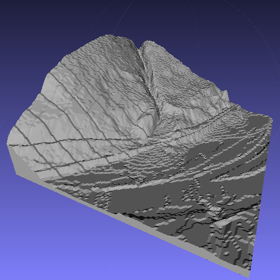

# Heightmap to STL

`hmstl` is a simple program to convert a grayscale heightmap image to a 3D model. The supported input heightmap image format is [raw PGM](http://netpbm.sourceforge.net/doc/pgm.html). The output format is [ASCII STL](http://www.ennex.com/~fabbers/StL.asp).

## Build

Compile `hmstl` with:

	make hmstl

## Usage

By default, `hmstl` expects to read a heightmap image from standard input and will print STL to standard output. The following options are also supported:

- `-i INPUT` read heightmap image from the specified `INPUT` file
- `-o OUTPUT` write STL output to the specified `OUTPUT` file
- `-z SCALE` multiple heightmap values by `SCALE`. Default: `1`
- `-b HEIGHT` set base thickness to `HEIGHT`. Default and minimum: `1`
- `-m` surface mesh only; omits base walls and bottom
- `-v` verbose mode (logs some info to standard error)

## Example

The file `tests/site.pgm` is a PGM version of the heightmap image displayed above.

Create an STL model of the heightmap with the following command. The `-z` option is used to scale height values; an appropriate value is dependent on the resolution of your dataset.

	./hmstl -z 0.5 < tests/site.pgm > tests/site.stl

Here is the output displayed in [Meshlab](http://meshlab.sourceforge.net/):

## License

Freely distributed under an [MIT License](LICENSE).

Portions of the heightmap loading code are derived from [Netpbm](http://netpbm.sourceforge.net) code distributed under the following terms:

> fileio.c - routines to read elements from Netpbm image files
> 
> Copyright (C) 1988 by Jef Poskanzer.
> 
> Permission to use, copy, modify, and distribute this software and its
> documentation for any purpose and without fee is hereby granted, provided
> that the above copyright notice appear in all copies and that both that
> copyright notice and this permission notice appear in supporting
> documentation.  This software is provided "as is" without express or
> implied warranty.
