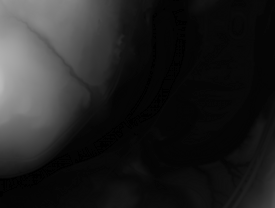
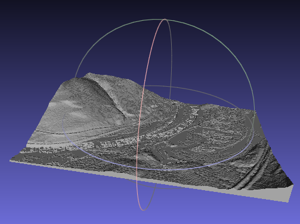
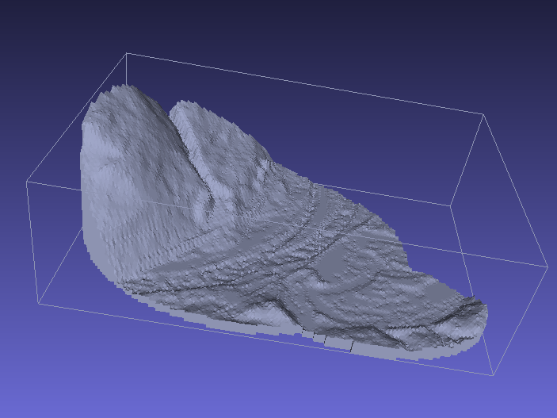
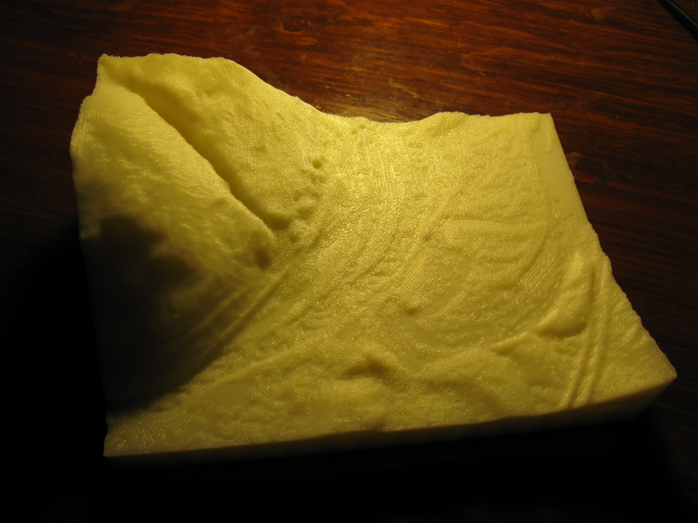

# Heightmap to STL

`hmstl` is a simple program to convert heightmap images to 3D models. The output format is [STL](http://www.ennex.com/~fabbers/StL.asp).

## Prerequisites

`hmstl` requires [libtrix](https://github.com/anoved/libtrix/), my rudimentary C library for generating STL files from triangle lists.

## Build

Compile `hmstl` with:

	make hmstl

## Usage

By default, `hmstl` can be used as a filter to convert heightmap images on standard input to STL models on standard output. The following options are also supported:

- `-i INPUT` read heightmap image from the specified `INPUT` file. Otherwise, read heightmap image from standard input.
- `-o OUTPUT` write STL data to the specified `OUTPUT` file. Otherwise, write STL data to standard output.
- `-z SCALE` multiple heightmap values by `SCALE`. Default: `1`
- `-b HEIGHT` set base thickness to `HEIGHT`. Default and minimum: `1`
- `-s` terrain surface only; omits base walls and bottom
- `-a` output ASCII STL instead of default binary STL

The following options apply a mask to the heightmap. Only the portion of the heightmap visible through the mask is output. This can be used to generate models of areas with non-rectangular boundaries.

- `-m MASK` load mask image from the specified `MASK` file. Dimensions must match heightmap dimensions.
- `-t THRESHOLD` consider mask values equal to or less than `THRESHOLD` to be opaque. Default: `127` (in range 0..255)
- `-h` as an alternative to `-m`, use the heightmap as its own mask; elevations below `THRESHOLD` are considered masked.
- `-r` reverse mask interpretation (swap transparent and opaque areas)

Supported input image formats include JPG (excluding progressive JPG), PNG, GIF, and BMP. Color images are interpreted as grayscale based on pixel luminance (0.3 R, 0.59 G, 0.11 B).

## Example

Create an STL model of `tests/scene.pgm`, the heightmap image above, with the following command. The `-z` option is used to scale height values; an appropriate value depends on dataset resolution and desired exaggeration.

	hmstl -z 0.25 < tests/scene.png > tests/scene.stl

Here is the output displayed in [Meshlab](http://meshlab.sourceforge.net/):

Here is a contrived masking example using the same heightmap and a compound oval mask:

	hmstl -z 0.25 -i tests/scene.png -m tests/mask.png -o tests/blob.stl

Here is a photo of a Makerbot printing of the [scene-thick](tests/scene-thick.stl) sample model:

## Scale and Orientation

Each pixel in the input heightmap is output as a unit quad (1 unit extent in xy plane) comprised of two triangles. By default, Z values are assumed to use the same units; use the `-z` option to set the correct scale.

The upper left pixel of the input heightmap is output centered at x/y 0/h, where h is the y extent of the heightmap, with the bottom of the model at z 0. Because the output pixel quads are 1 unit square centered over the pixel coordinates, the actual upper left extent of the output model is at -0.5, h + 0.5. 

## Post-Processing

Meshlab's *Quadric Edge Collapse Decimation* filter is suitable for simplifying `hmstl` output to reduce the number of faces without losing important features. Use various constraints such as *Preserve Boundary* or *Planar Simplification* to ensure original edges are preserved.

## License

Freely distributed under an [MIT License](LICENSE). See the `LICENSE` files for details.

## Acknowledgements

Heightmap images are loaded using [Sean Barrett](http://nothings.org/)'s public domain [stb_image.c](http://nothings.org/stb_image.c) library.
